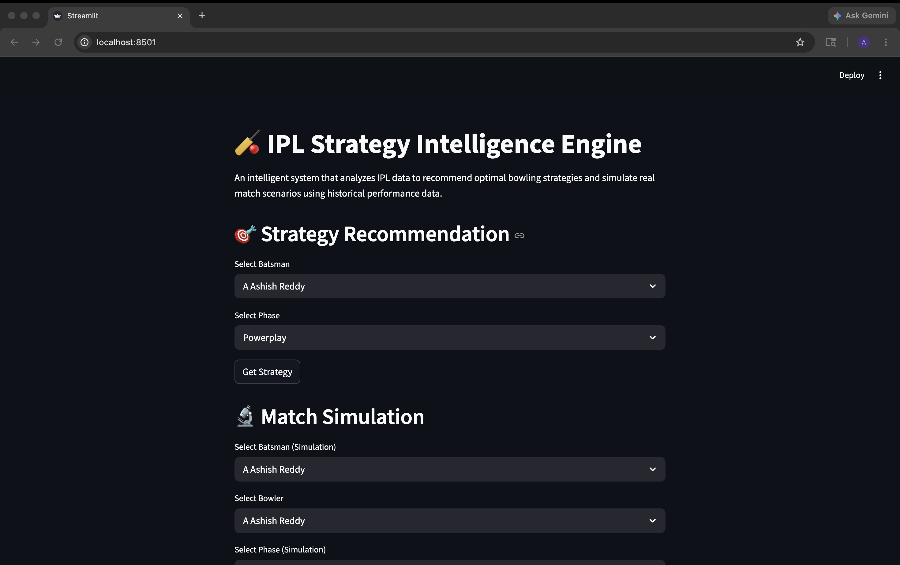
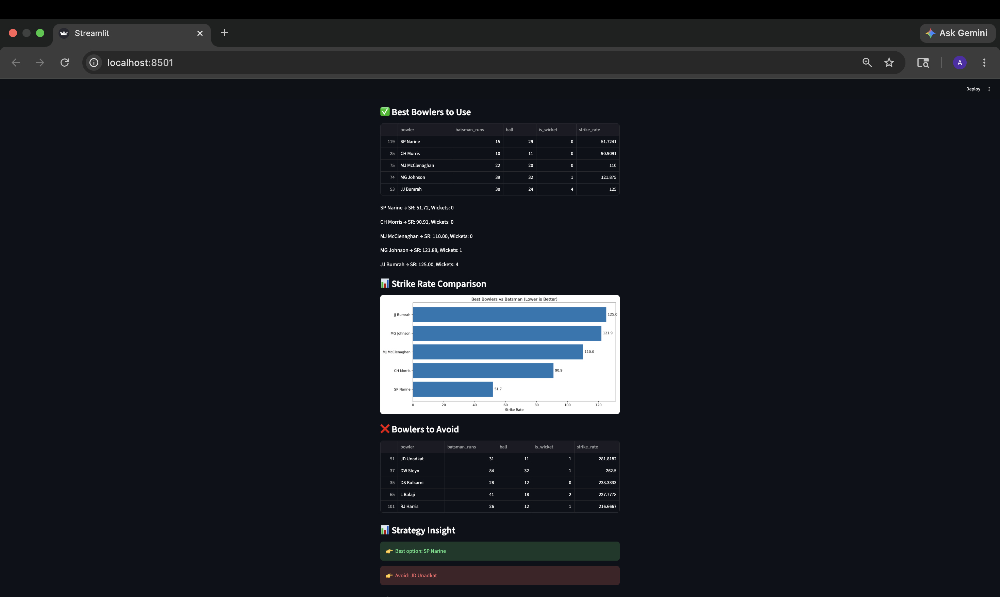

#  IPL Strategy Intelligence Engine — Prototype v1

##  Overview

IPL Strategy Intelligence Engine is a prototype cricket decision intelligence system built using historical IPL ball-by-ball data.

The project analyzes batsman vs bowler matchups across different match phases and recommends tactical bowling strategies using strike-rate and wicket-based analytics.

It also includes matchup simulation and visual insights to support smarter cricket decision-making.

---

##  Why This Project?

Most beginner cricket analytics projects focus only on dashboards or basic statistics.

This project was built to go beyond traditional visualization and create a system that can assist in actual tactical decisions such as:

* Which bowler should be used against a batsman?
* Which matchup is risky?
* How does performance change across match phases?
* Which bowlers consistently control scoring?

The goal was to transform raw IPL data into actionable cricket intelligence.

---

##  Current Status

This is **Prototype v1** of the IPL Strategy Intelligence Engine.

###  Current Capabilities

* Batsman vs Bowler matchup analysis
* Phase-wise strategy recommendations
* Strike-rate intelligence
* Wicket-based analysis
* Matchup simulation support
* Interactive Streamlit interface
* Visual analytics graphs

###  Planned Future Upgrades

* Advanced simulation engine
* Newer IPL seasons integration
* Predictive analytics
* Improved UI/UX
* Intelligence scoring system
* Live data integration
* Match win probability logic

---

## Features

*  Batsman vs Bowler matchup analytics
*  Tactical bowling recommendations
*  Strike-rate based intelligence
*  Best bowlers to use
*  Bowlers to avoid
*  Phase-wise analysis (Powerplay, Middle, Death)
*  Matchup simulation engine
*  Visual analytics and comparison graphs
*  Interactive Streamlit application

---

##  Project Screenshots

###  Homepage



---

### 📊 Strategy Recommendation & Analytics



---

## ⚙️ Tech Stack

### Core Technologies

* Python
* Pandas
* Streamlit
* Matplotlib

### Development Tools

* GitHub
* Jupyter Notebook
* MacOS Terminal

---

##  Project Structure

```text
IPL-Strategy-Intelligence-Engine-Prototype-v1/
│
├── app.py
├── data/
│   └── deliveries (2).csv
├── screenshots/
│   ├── homepage.png
│   └── strategy-analysis.png
├── README.md
```

---

##  Run Locally

Run the Streamlit application using:

```bash
python3 -m streamlit run app.py
```

After running the command, open the localhost URL shown in terminal.

---

## Key Concepts Used

* Data Analysis
* Feature Engineering
* Matchup Analytics
* Strike Rate Intelligence
* Tactical Decision Support
* Data Visualization
* Interactive Web App Development

---

## Future Vision

The long-term vision for this project is to evolve it into a more advanced cricket intelligence platform capable of:

* deeper tactical insights
* predictive matchup modeling
* real-time analytics
* richer visual dashboards
* advanced simulation systems

---


## Prototype v1 — Built as part of a continuous learning and product-building journey.
